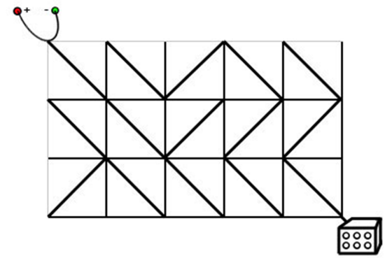

### Flood Fill模型
```c++
/*
    池塘计数：农夫约翰有一片 N∗M 的矩形土地。
         最近，由于降雨的原因，部分土地被水淹没了。
         现在用一个字符矩阵来表示他的土地。
         每个单元格内，如果包含雨水，则用”W”表示，如果不含雨水，则用”.”表示。
         现在，约翰想知道他的土地中形成了多少片池塘。
         每组相连的积水单元格集合可以看作是一片池塘。
         每个单元格视为与其上、下、左、右、左上、右上、左下、右下八个邻近单元格相连。
         请你输出共有多少片池塘，即矩阵中共有多少片相连的”W”块。
 * */
#include "iostream"
#include "queue"
using namespace std;
typedef pair<int,int> PII;
const int SIZE = 1010;
char s[SIZE][SIZE];
int n,m,count;
bool v[SIZE][SIZE];

int main(){
    cin>>n>>m;
    for(int i=0;i<n;++i)
        cin>>s[i];
    for(int i=0;i<n;++i)
        for(int j=0;j<=m;++j)
            if(!v[i][j]&&s[i][j]=='W'){
                count++;
                queue<PII> q;
                q.push(PII(i,j));
                v[i][j]=1;
                while(q.size()){
                    int x = q.front().first;
                    int y = q.front().second;
                    q.pop();
                    for(int a=x-1;a<=x+1;++a)
                        for(int b = y-1;b<=y+1;++b){
                            if(a==x&&b==y)continue;
                            if(a<0||a>=n||b<0||b>=m)continue;
                            if(v[a][b]||s[a][b]!='W')continue;
                            q.push(PII(a,b));
                            v[a][b]=1;
                        }
                }
            }
    cout<<count;
}
/*
    城堡问题
    请你编写一个程序，计算城堡一共有多少房间，最大的房间有多大。
    城堡被分割成 m∗n个方格区域，每个方格区域可以有0~4面墙。
    输入格式
    第一行包含两个整数 m 和 n，分别表示城堡南北方向的长度和东西方向的长度。
    接下来 m 行，每行包含 n 个整数，每个整数都表示平面图对应位置的方块的墙的特征。
    每个方块中墙的特征由数字 P 来描述，我们用1表示西墙，2表示北墙，4表示东墙，8表示南墙，P 为该方块包含墙的数字之和。
    例如，如果一个方块的 P 为3，则 3 = 1 + 2，该方块包含西墙和北墙。
    城堡的内墙被计算两次，方块(1,1)的南墙同时也是方块(2,1)的北墙。
    输入的数据保证城堡至少有两个房间。
 * */
#include "iostream"
#include "queue"
using namespace std;
const int SIZE = 55;
int r[SIZE][SIZE];
bool v[SIZE][SIZE];
typedef pair<int,int> PII;

int dx[]={0,-1,0,1},dy[]={-1,0,1,0};
int main(){
    int n,m;
    cin>>n>>m;
    int max_root_size = 1;
    int root_count = 0;
    for(int i=1;i<=n;++i)
        for(int j=1;j<=m;++j)
            cin>>r[i][j];
    for(int i=1;i<=n;++i)
        for(int j=1;j<=m;++j){
            if(v[i][j])continue;
            v[i][j]=1;//表示入队
            root_count++;
            int cur_room_size = 1;
            queue<PII> q;
            q.push(PII(i,j));
            while(q.size()){
                int x = q.front().first;
                int y = q.front().second;
                q.pop();
                for(int k=0;k<=3;k++){//四个方向 西 北 东 南
                    if(r[x][y]&(1<<k))continue;//有墙
                    int new_x = x+dx[k],new_y = y+dy[k];
                    if(v[new_x][new_y])continue;
                    v[new_x][new_y]=1;
                    cur_room_size++;
                    q.push(PII(new_x,new_y));
                }
            }
            max_root_size = max(max_root_size,cur_room_size);
        }
    cout<<root_count<<endl<<max_root_size;
}

/*
    山峰和山谷
    FGD小朋友特别喜欢爬山，在爬山的时候他就在研究山峰和山谷。
    为了能够对旅程有一个安排，他想知道山峰和山谷的数量。
    给定一个地图，为FGD想要旅行的区域，地图被分为 n×n 的网格，每个格子 (i,j) 的高度 w(i,j) 是给定的。
    若两个格子有公共顶点，那么它们就是相邻的格子，如与 (i,j) 相邻的格子有(i−1,j−1),(i−1,j),(i−1,j+1),(i,j−1),(i,j+1),(i+1,j−1),(i+1,j),(i+1,j+1)。
    我们定义一个格子的集合 S 为山峰（山谷）当且仅当：
    S 的所有格子都有相同的高度。
    S 的所有格子都连通。
    对于 s 属于 S，与 s 相邻的 s′ 不属于 S，都有 ws>ws′（山峰），或者 ws<ws′（山谷）。
    如果周围不存在相邻区域，则同时将其视为山峰和山谷。
    你的任务是，对于给定的地图，求出山峰和山谷的数量，如果所有格子都有相同的高度，那么整个地图即是山峰，又是山谷。
 * */
#include "iostream"
#include "queue"
using namespace std;
const int SIZE = 1010;
int h[SIZE][SIZE];
bool v[SIZE][SIZE];

typedef pair<int,int> PII;
int dx[]={-1,0,1,0},dy[]={0,1,0,-1};
int main(){
    int n;
    cin>>n;
    for(int i=1;i<=n;++i)
        for(int j=1;j<=n;++j)
            cin>>h[i][j];
    int mount_count=0,valley_count = 0;
    for(int i=1;i<=n;++i)
        for(int j=1;j<=n;++j)
            if(!v[i][j]){
                bool has_higher=false;
                bool has_lower=false;
                queue<PII> q;
                v[i][j]=1;//入队
                q.push(PII(i,j));
                while(q.size()){
                    int x = q.front().first;
                    int y = q.front().second;
                    q.pop();
                    for(int new_x = x-1;new_x<=x+1;++new_x)
                        for(int new_y = y-1;new_y<=y+1;++new_y){
                            if(new_x==x&&new_y==y)continue;
                            if(new_x>=1&&new_x<=n&&new_y>=1&&new_y<=n){
                                if(h[new_x][new_y]>h[x][y])has_higher=true;
                                else if(h[new_x][new_y]<h[x][y])has_lower=true;
                                else{
                                    if(v[new_x][new_y])continue;
                                    q.push(PII(new_x,new_y));
                                    v[new_x][new_y]=1;
                                }
                            }
                        }

                }
                if(!has_higher)mount_count++;
                if(!has_lower)valley_count++;
            }
    cout<<mount_count<<" "<<valley_count;
}
```

### 最短路模型
```c++
/*
    迷宫问题
    给定一个 n×n 的二维数组它表示一个迷宫，其中的1表示墙壁，0表示可以走的路，只能横着走或竖着走，不能斜着走，要求编程序找出从左上角到右下角的最短路线。
    数据保证至少存在一条从左上角走到右下角的路径。
 * */
#include "iostream"
#include "stack"
#include "cstring"
#include "queue"
using namespace std;
const int SIZE = 1010;
bool a[SIZE][SIZE];
bool v[SIZE][SIZE];
typedef pair<int,int> PII;
int n,dx[]={-1,0,1,0},dy[]={0,1,0,-1};
PII pre[SIZE][SIZE];

int main(){
    cin>>n;
    for(int i=0;i<n;++i)
        for(int j=0;j<n;++j)
            cin>>a[i][j];
    queue<PII> q;
    q.push(PII(0,0));
    v[0][0]=1;
    pre[0][0]={-1,-1};
    while(q.size()){
        int x = q.front().first;
        int y = q.front().second;
        if(x==n-1&&y==n-1){
            int prex,prey;
            stack<PII> s;
            do{
                prex = pre[x][y].first,prey = pre[x][y].second;
                s.push(PII(x,y));
                x = prex,y=prey;
            }while(prex!=-1&&prey!=-1);
            while(s.size()){
                cout<<s.top().first<<" "<<s.top().second<<endl;
                s.pop();
            }
        }
        q.pop();
        for(int i=0;i<4;++i){
            int new_x = x+dx[i],new_y = y+dy[i];
            if(new_x>=0&&new_x<n&&new_y>=0&&new_y<n&&!a[new_x][new_y]&&!v[new_x][new_y]){
                pre[new_x][new_y]={x,y};
                q.push(PII(new_x,new_y));
                v[new_x][new_y]=1;
            }
        }
    }
}
/*
    武士风度的牛
    农民 John 有很多牛，他想交易其中一头被 Don 称为 The Knight 的牛。
    这头牛有一个独一无二的超能力，在农场里像 Knight 一样地跳（就是我们熟悉的象棋中马的走法）。
    虽然这头神奇的牛不能跳到树上和石头上，但是它可以在牧场上随意跳，我们把牧场用一个 x，y 的坐标图来表示。
    这头神奇的牛像其它牛一样喜欢吃草，给你一张地图，上面标注了 The Knight 的开始位置，树、灌木、石头以及其它障碍的位置，除此之外还有一捆草。
    现在你的任务是，确定 The Knight 要想吃到草，至少需要跳多少次。
    The Knight 的位置用 K 来标记，障碍的位置用 * 来标记，草的位置用 H 来标记。
 */
#include "iostream"
#include "queue"
using namespace std;
const int SIZE = 155;
char a[SIZE][SIZE];
int d[SIZE][SIZE];
typedef pair<int,int>PII;
bool v[SIZE][SIZE];
int main(){
    int start_x,start_y;
    int r,c;
    cin>>c>>r;
    for(int i=1;i<=r;++i)cin>>a[i]+1;
    for(int i=1;i<=r;++i)
        for(int j=1;j<=c;++j)
            if(a[i][j]=='K')start_x = i,start_y= j;
    int dx[]={1,1,-1,-1,2,2,-2,-2},dy[]={2,-2,2,-2,1,-1,1,-1};//8个方向
    
    queue<PII> q;
    q.push(PII(start_x,start_y));
    v[start_x][start_y]=1;
    d[start_x][start_y]=0;
    while(q.size()){
        int x = q.front().first;
        int y = q.front().second;
        if(a[x][y]=='H'){
            cout<<d[x][y];
            return 0;
        }
        q.pop();
        for(int i=0;i<8;++i){
            int new_x = x+dx[i],new_y = y+ dy[i];
            if(new_x>=1&&new_x<=r&&new_y>=1&&new_y<=c&&!v[new_x][new_y]&&a[new_x][new_y]!='*'){
                v[new_x][new_y]=1;
                q.push(PII(new_x,new_y));
                d[new_x][new_y]=d[x][y]+1;
            }
        }
    }
    return 0;
}
/*
    抓住那头牛
    农夫知道一头牛的位置，想要抓住它。
    农夫和牛都位于数轴上，农夫起始位于点 N，牛位于点 K。
    农夫有两种移动方式：
    从 X 移动到 X−1 或 X+1，每次移动花费一分钟
    从 X 移动到 2∗X，每次移动花费一分钟
    假设牛没有意识到农夫的行动，站在原地不动。
    农夫最少要花多少时间才能抓住牛？
 * */
#include "iostream"
#include "queue"
#include "cstring"
using namespace std;
const int SIZE = 1e5+10;
int a[SIZE];

int main(){
    int s,e;
    cin>>s>>e;
    memset(a,-1,sizeof(a));
    a[s]=0;
    queue<int> q;
    q.push(s);
    while(q.size()){
        int cur = q.front();
        q.pop();
        if(cur==e){
            cout<<a[e];
            return 0;
        }
        if(cur-1>=0&&a[cur-1]==-1)q.push(cur-1),a[cur-1]=a[cur]+1;
        if(cur+1<SIZE&&a[cur+1]==-1)q.push(cur+1),a[cur+1]=a[cur]+1;
        if(cur*2<SIZE&&a[cur*2]==-1)q.push(cur*2),a[cur*2]=a[cur]+1;
    }
    return 0;
}

```
### 多源BFS
```c++
/*
    矩阵距离
    给定一个 N 行 M 列的 01 矩阵 A，A[i][j] 与 A[k][l] 之间的曼哈顿距离定义为：
    dist(A[i][j],A[k][l])=|i−k|+|j−l|
    输出一个 N 行 M 列的整数矩阵 B，其中：
    B[i][j]=min1≤x≤N,1≤y≤M,A[x][y]=1dist(A[i][j],A[x][y])
 * */
#include "iostream"
#include "queue"
using namespace std;
const int SIZE = 1010;
int d[SIZE][SIZE];
bool v[SIZE][SIZE],a[SIZE][SIZE];
typedef pair<int,int> PII;
int dx[]={0,1,0,-1},dy[]={-1,0,1,0};
char s[SIZE];

int main(){
    int n,m;
    cin>>n>>m;
    queue<PII> q;
    for(int i=1;i<=n;++i){
        cin>>s+1;
        for(int j=1;j<=m;++j){
            a[i][j]=s[j]-'0';
            if(a[i][j]){
                v[i][j]=1;
                q.push(PII(i,j));
                d[i][j]=0;
            }
        }
    }
    while(q.size()){
        int x = q.front().first;
        int y = q.front().second;
        q.pop();
        //cout<<x<<" "<<y<<" "<<a[x][y]<<" "<<d[x][y]<<endl;
        for(int i=0;i<4;++i){
            int new_x = x+dx[i],new_y = y+dy[i];
            if(new_x>=1&&new_x<=n&&new_y>=1&&new_y<=m&&!v[new_x][new_y]){
                v[new_x][new_y]=1;
                q.push(PII(new_x,new_y));
                d[new_x][new_y]=d[x][y]+1;
            }
        }
    }
    for(int i=1;i<=n;++i){
        for(int j=1;j<=m;++j)
            cout<<d[i][j]<<" ";
        cout<<endl;
    }
}
```
### 最小步数模型
```c++
/*
    魔板
    Rubik 先生在发明了风靡全球的魔方之后，又发明了它的二维版本——魔板。
    这是一张有 8 个大小相同的格子的魔板：
    1 2 3 4
    8 7 6 5
    我们知道魔板的每一个方格都有一种颜色。
    这 8 种颜色用前 8 个正整数来表示。
    可以用颜色的序列来表示一种魔板状态，规定从魔板的左上角开始，沿顺时针方向依次取出整数，构成一个颜色序列。
    对于上图的魔板状态，我们用序列 (1,2,3,4,5,6,7,8) 来表示，这是基本状态。
    这里提供三种基本操作，分别用大写字母 A，B，C 来表示（可以通过这些操作改变魔板的状态）：
    A：交换上下两行；
    B：将最右边的一列插入到最左边；
    C：魔板中央对的4个数作顺时针旋转。
 * */
#include "iostream"
#include "unordered_map"
#include "cstring"
#include "queue"
#include "stack"
using namespace std;

struct Info{
    string pre;
    int dis;
    char type;
};

int main(){
    string end,start="12348765";
    int val[10];
    for(int i=1;i<=4;++i)cin>>val[i];
    for(int i=8;i>=5;--i)cin>>val[i];
    for(int i=1;i<=8;++i)
        end+=val[i]+'0';
    //cout<<start<<endl;
    unordered_map<string,Info> Node_Info;//当前状态的距离，前驱，前驱的转移方式
    Node_Info[start]={"",0,'\0'};
    queue<string> q;
    q.push(start);
    while(q.size()){
        string cur = q.front();
        q.pop();

        if(cur==end) {
            cout<<Node_Info[end].dis<<endl;
            stack<char> s;
            string pos = end;
            while(pos!=start){
                s.push(Node_Info[pos].type);
                pos = Node_Info[pos].pre;
            }
            while(s.size()){
                cout<<s.top();
                s.pop();
            }
            return 0;
        }
        //三种情况
        //A
        string pos = cur;
        for(int i=0,j=4;i<=3;++i,++j)swap(pos[i],pos[j]);
        if(Node_Info.count(pos)==0){
            Node_Info[pos]={cur,Node_Info[cur].dis+1,'A'};
            q.push(pos);
        }
        //B
        pos[0]=cur[3],pos[1]=cur[0],pos[2]=cur[1],pos[3]=cur[2];
        pos[4]=cur[7],pos[5]=cur[4],pos[6]=cur[5],pos[7]=cur[6];
        if(Node_Info.count(pos)==0){
            Node_Info[pos]={cur,Node_Info[cur].dis+1,'B'};
            q.push(pos);
        }
        //C
        pos[0]=cur[0],pos[1]=cur[5],pos[2]=cur[1],pos[3]=cur[3];
        pos[4]=cur[4],pos[5]=cur[6],pos[6]=cur[2],pos[7]=cur[7];
        if(Node_Info.count(pos)==0){
            Node_Info[pos]={cur,Node_Info[cur].dis+1,'C'};
            q.push(pos);
        }
    }
}
```
### 双端队列模型
    双端队列用于解决点到点距离仅为0和1的最短路问题
    电路维修
    达达是来自异世界的魔女，她在漫无目的地四处漂流的时候，遇到了善良的少女翰翰，从而被收留在地球上。
    
    翰翰的家里有一辆飞行车。
    
    有一天飞行车的电路板突然出现了故障，导致无法启动。
    
    电路板的整体结构是一个 R 行 C 列的网格（R,C≤500），如下图所示。


```c++
#include <deque>
#include <cstring>
#include "iostream"
using namespace std;
const int SIZE = 510;
int h[SIZE*SIZE],idx,dis[SIZE*SIZE];
bool v[SIZE*SIZE];

struct Edge{
    int next;
    int ver;
    bool dis;
}edge[SIZE*SIZE*4];

void add(int a,int b,bool dis){
    edge[++idx].ver =b;
    edge[idx].next = h[a];
    h[a]=idx;
    edge[idx].dis = dis;
}

char s[SIZE];
int main(){
    int r,c;
    int t;
    cin>>t;
    while(t--) {
        cin >> r >> c;idx = 0;
        memset(h,0,sizeof(h));
        memset(dis,0x3f,sizeof(dis));
        memset(v,0,sizeof(v));
        for (int i = 0; i < r; ++i) {
            cin >> s;
            for (int j = 0; j < c; ++j) {
                int left_top = (c + 1) * i + j;
                int right_top = (c + 1) * i + j + 1;
                int left_down = (c + 1) * (i + 1) + j;
                int right_down = (c + 1) * (i + 1) + j + 1;
                if (s[j] == '/') {
                    add(left_down, right_top, 0);
                    add(right_top, left_down, 0);
                    add(left_top, right_down, 1);
                    add(right_down, left_top, 1);
                } else {
                    add(left_top, right_down, 0);
                    add(right_down, left_top, 0);
                    add(left_down, right_top, 1);
                    add(right_top, left_down, 1);
                }
            }
        }
        if ((r + c) % 2 == 1)cout << "NO SOLUTION" << endl;
        else {

            int start = 0, end = (c + 1) * (r + 1) - 1;
            //<<start<<" "<<end<<endl;
            deque<int> q;
            q.push_back(start);
            dis[0]=0;
            while(q.size()){
                int cur = q.front();
                //cout<<"q.size():"<<q.size()<<" cur:"<<cur<<" cur_dis:"<<dis[cur]<<endl;
                q.pop_front();
                if(v[cur])continue;
                v[cur]=1;
                //cout<<(cur==end)<<endl;
                if(cur==end){
                    cout<<dis[end]<<endl;
                    break;
                }
                int ne = h[cur];
                while(ne){
                    int pos = edge[ne].ver;
                    if(!v[pos]) {
                        if(edge[ne].dis){
                            q.push_back(pos);
                            dis[pos]=min(dis[pos],dis[cur]+1);
                        }else{
                            q.push_front(pos);
                            dis[pos]=min(dis[pos],dis[cur]);
                        }
                    }
                    ne = edge[ne].next;
                }
            }
        }
    }
}
```

### 双向广搜
```c++
/*
    字串变换
    已知有两个字串 A, B 及一组字串变换的规则（至多 6 个规则）:
    A1→B1
    A2→B2
    …
    规则的含义为：在 A 中的子串 A1 可以变换为 B1、A2 可以变换为 B2…。
    例如：A＝abcd B＝xyz
    变换规则为：
    abc → xu ud → y y → yz
    则此时，A 可以经过一系列的变换变为 B，其变换的过程为：
    abcd → xud → xy → xyz
    共进行了三次变换，使得 A 变换为 B。
 * */
```