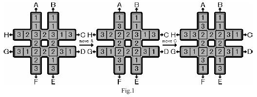

### Flood Fill模型
```c++
/*
    池塘计数：农夫约翰有一片 N∗M 的矩形土地。
         最近，由于降雨的原因，部分土地被水淹没了。
         现在用一个字符矩阵来表示他的土地。
         每个单元格内，如果包含雨水，则用”W”表示，如果不含雨水，则用”.”表示。
         现在，约翰想知道他的土地中形成了多少片池塘。
         每组相连的积水单元格集合可以看作是一片池塘。
         每个单元格视为与其上、下、左、右、左上、右上、左下、右下八个邻近单元格相连。
         请你输出共有多少片池塘，即矩阵中共有多少片相连的”W”块。
 * */
#include "iostream"
#include "queue"
using namespace std;
typedef pair<int,int> PII;
const int SIZE = 1010;
char s[SIZE][SIZE];
int n,m,count;
bool v[SIZE][SIZE];

int main(){
    cin>>n>>m;
    for(int i=0;i<n;++i)
        cin>>s[i];
    for(int i=0;i<n;++i)
        for(int j=0;j<=m;++j)
            if(!v[i][j]&&s[i][j]=='W'){
                count++;
                queue<PII> q;
                q.push(PII(i,j));
                v[i][j]=1;
                while(q.size()){
                    int x = q.front().first;
                    int y = q.front().second;
                    q.pop();
                    for(int a=x-1;a<=x+1;++a)
                        for(int b = y-1;b<=y+1;++b){
                            if(a==x&&b==y)continue;
                            if(a<0||a>=n||b<0||b>=m)continue;
                            if(v[a][b]||s[a][b]!='W')continue;
                            q.push(PII(a,b));
                            v[a][b]=1;
                        }
                }
            }
    cout<<count;
}
/*
    城堡问题
    请你编写一个程序，计算城堡一共有多少房间，最大的房间有多大。
    城堡被分割成 m∗n个方格区域，每个方格区域可以有0~4面墙。
    输入格式
    第一行包含两个整数 m 和 n，分别表示城堡南北方向的长度和东西方向的长度。
    接下来 m 行，每行包含 n 个整数，每个整数都表示平面图对应位置的方块的墙的特征。
    每个方块中墙的特征由数字 P 来描述，我们用1表示西墙，2表示北墙，4表示东墙，8表示南墙，P 为该方块包含墙的数字之和。
    例如，如果一个方块的 P 为3，则 3 = 1 + 2，该方块包含西墙和北墙。
    城堡的内墙被计算两次，方块(1,1)的南墙同时也是方块(2,1)的北墙。
    输入的数据保证城堡至少有两个房间。
 * */
#include "iostream"
#include "queue"
using namespace std;
const int SIZE = 55;
int r[SIZE][SIZE];
bool v[SIZE][SIZE];
typedef pair<int,int> PII;

int dx[]={0,-1,0,1},dy[]={-1,0,1,0};
int main(){
    int n,m;
    cin>>n>>m;
    int max_root_size = 1;
    int root_count = 0;
    for(int i=1;i<=n;++i)
        for(int j=1;j<=m;++j)
            cin>>r[i][j];
    for(int i=1;i<=n;++i)
        for(int j=1;j<=m;++j){
            if(v[i][j])continue;
            v[i][j]=1;//表示入队
            root_count++;
            int cur_room_size = 1;
            queue<PII> q;
            q.push(PII(i,j));
            while(q.size()){
                int x = q.front().first;
                int y = q.front().second;
                q.pop();
                for(int k=0;k<=3;k++){//四个方向 西 北 东 南
                    if(r[x][y]&(1<<k))continue;//有墙
                    int new_x = x+dx[k],new_y = y+dy[k];
                    if(v[new_x][new_y])continue;
                    v[new_x][new_y]=1;
                    cur_room_size++;
                    q.push(PII(new_x,new_y));
                }
            }
            max_root_size = max(max_root_size,cur_room_size);
        }
    cout<<root_count<<endl<<max_root_size;
}

/*
    山峰和山谷
    FGD小朋友特别喜欢爬山，在爬山的时候他就在研究山峰和山谷。
    为了能够对旅程有一个安排，他想知道山峰和山谷的数量。
    给定一个地图，为FGD想要旅行的区域，地图被分为 n×n 的网格，每个格子 (i,j) 的高度 w(i,j) 是给定的。
    若两个格子有公共顶点，那么它们就是相邻的格子，如与 (i,j) 相邻的格子有(i−1,j−1),(i−1,j),(i−1,j+1),(i,j−1),(i,j+1),(i+1,j−1),(i+1,j),(i+1,j+1)。
    我们定义一个格子的集合 S 为山峰（山谷）当且仅当：
    S 的所有格子都有相同的高度。
    S 的所有格子都连通。
    对于 s 属于 S，与 s 相邻的 s′ 不属于 S，都有 ws>ws′（山峰），或者 ws<ws′（山谷）。
    如果周围不存在相邻区域，则同时将其视为山峰和山谷。
    你的任务是，对于给定的地图，求出山峰和山谷的数量，如果所有格子都有相同的高度，那么整个地图即是山峰，又是山谷。
 * */
#include "iostream"
#include "queue"
using namespace std;
const int SIZE = 1010;
int h[SIZE][SIZE];
bool v[SIZE][SIZE];

typedef pair<int,int> PII;
int dx[]={-1,0,1,0},dy[]={0,1,0,-1};
int main(){
    int n;
    cin>>n;
    for(int i=1;i<=n;++i)
        for(int j=1;j<=n;++j)
            cin>>h[i][j];
    int mount_count=0,valley_count = 0;
    for(int i=1;i<=n;++i)
        for(int j=1;j<=n;++j)
            if(!v[i][j]){
                bool has_higher=false;
                bool has_lower=false;
                queue<PII> q;
                v[i][j]=1;//入队
                q.push(PII(i,j));
                while(q.size()){
                    int x = q.front().first;
                    int y = q.front().second;
                    q.pop();
                    for(int new_x = x-1;new_x<=x+1;++new_x)
                        for(int new_y = y-1;new_y<=y+1;++new_y){
                            if(new_x==x&&new_y==y)continue;
                            if(new_x>=1&&new_x<=n&&new_y>=1&&new_y<=n){
                                if(h[new_x][new_y]>h[x][y])has_higher=true;
                                else if(h[new_x][new_y]<h[x][y])has_lower=true;
                                else{
                                    if(v[new_x][new_y])continue;
                                    q.push(PII(new_x,new_y));
                                    v[new_x][new_y]=1;
                                }
                            }
                        }

                }
                if(!has_higher)mount_count++;
                if(!has_lower)valley_count++;
            }
    cout<<mount_count<<" "<<valley_count;
}
```

### 最短路模型
```c++
/*
    迷宫问题
    给定一个 n×n 的二维数组它表示一个迷宫，其中的1表示墙壁，0表示可以走的路，只能横着走或竖着走，不能斜着走，要求编程序找出从左上角到右下角的最短路线。
    数据保证至少存在一条从左上角走到右下角的路径。
 * */
#include "iostream"
#include "stack"
#include "cstring"
#include "queue"
using namespace std;
const int SIZE = 1010;
bool a[SIZE][SIZE];
bool v[SIZE][SIZE];
typedef pair<int,int> PII;
int n,dx[]={-1,0,1,0},dy[]={0,1,0,-1};
PII pre[SIZE][SIZE];

int main(){
    cin>>n;
    for(int i=0;i<n;++i)
        for(int j=0;j<n;++j)
            cin>>a[i][j];
    queue<PII> q;
    q.push(PII(0,0));
    v[0][0]=1;
    pre[0][0]={-1,-1};
    while(q.size()){
        int x = q.front().first;
        int y = q.front().second;
        if(x==n-1&&y==n-1){
            int prex,prey;
            stack<PII> s;
            do{
                prex = pre[x][y].first,prey = pre[x][y].second;
                s.push(PII(x,y));
                x = prex,y=prey;
            }while(prex!=-1&&prey!=-1);
            while(s.size()){
                cout<<s.top().first<<" "<<s.top().second<<endl;
                s.pop();
            }
        }
        q.pop();
        for(int i=0;i<4;++i){
            int new_x = x+dx[i],new_y = y+dy[i];
            if(new_x>=0&&new_x<n&&new_y>=0&&new_y<n&&!a[new_x][new_y]&&!v[new_x][new_y]){
                pre[new_x][new_y]={x,y};
                q.push(PII(new_x,new_y));
                v[new_x][new_y]=1;
            }
        }
    }
}
/*
    武士风度的牛
    农民 John 有很多牛，他想交易其中一头被 Don 称为 The Knight 的牛。
    这头牛有一个独一无二的超能力，在农场里像 Knight 一样地跳（就是我们熟悉的象棋中马的走法）。
    虽然这头神奇的牛不能跳到树上和石头上，但是它可以在牧场上随意跳，我们把牧场用一个 x，y 的坐标图来表示。
    这头神奇的牛像其它牛一样喜欢吃草，给你一张地图，上面标注了 The Knight 的开始位置，树、灌木、石头以及其它障碍的位置，除此之外还有一捆草。
    现在你的任务是，确定 The Knight 要想吃到草，至少需要跳多少次。
    The Knight 的位置用 K 来标记，障碍的位置用 * 来标记，草的位置用 H 来标记。
 */
#include "iostream"
#include "queue"
using namespace std;
const int SIZE = 155;
char a[SIZE][SIZE];
int d[SIZE][SIZE];
typedef pair<int,int>PII;
bool v[SIZE][SIZE];
int main(){
    int start_x,start_y;
    int r,c;
    cin>>c>>r;
    for(int i=1;i<=r;++i)cin>>a[i]+1;
    for(int i=1;i<=r;++i)
        for(int j=1;j<=c;++j)
            if(a[i][j]=='K')start_x = i,start_y= j;
    int dx[]={1,1,-1,-1,2,2,-2,-2},dy[]={2,-2,2,-2,1,-1,1,-1};//8个方向
    
    queue<PII> q;
    q.push(PII(start_x,start_y));
    v[start_x][start_y]=1;
    d[start_x][start_y]=0;
    while(q.size()){
        int x = q.front().first;
        int y = q.front().second;
        if(a[x][y]=='H'){
            cout<<d[x][y];
            return 0;
        }
        q.pop();
        for(int i=0;i<8;++i){
            int new_x = x+dx[i],new_y = y+ dy[i];
            if(new_x>=1&&new_x<=r&&new_y>=1&&new_y<=c&&!v[new_x][new_y]&&a[new_x][new_y]!='*'){
                v[new_x][new_y]=1;
                q.push(PII(new_x,new_y));
                d[new_x][new_y]=d[x][y]+1;
            }
        }
    }
    return 0;
}
/*
    抓住那头牛
    农夫知道一头牛的位置，想要抓住它。
    农夫和牛都位于数轴上，农夫起始位于点 N，牛位于点 K。
    农夫有两种移动方式：
    从 X 移动到 X−1 或 X+1，每次移动花费一分钟
    从 X 移动到 2∗X，每次移动花费一分钟
    假设牛没有意识到农夫的行动，站在原地不动。
    农夫最少要花多少时间才能抓住牛？
 * */
#include "iostream"
#include "queue"
#include "cstring"
using namespace std;
const int SIZE = 1e5+10;
int a[SIZE];

int main(){
    int s,e;
    cin>>s>>e;
    memset(a,-1,sizeof(a));
    a[s]=0;
    queue<int> q;
    q.push(s);
    while(q.size()){
        int cur = q.front();
        q.pop();
        if(cur==e){
            cout<<a[e];
            return 0;
        }
        if(cur-1>=0&&a[cur-1]==-1)q.push(cur-1),a[cur-1]=a[cur]+1;
        if(cur+1<SIZE&&a[cur+1]==-1)q.push(cur+1),a[cur+1]=a[cur]+1;
        if(cur*2<SIZE&&a[cur*2]==-1)q.push(cur*2),a[cur*2]=a[cur]+1;
    }
    return 0;
}

```
### 多源BFS
```c++
/*
    矩阵距离
    给定一个 N 行 M 列的 01 矩阵 A，A[i][j] 与 A[k][l] 之间的曼哈顿距离定义为：
    dist(A[i][j],A[k][l])=|i−k|+|j−l|
    输出一个 N 行 M 列的整数矩阵 B，其中：
    B[i][j]=min1≤x≤N,1≤y≤M,A[x][y]=1dist(A[i][j],A[x][y])
 * */
#include "iostream"
#include "queue"
using namespace std;
const int SIZE = 1010;
int d[SIZE][SIZE];
bool v[SIZE][SIZE],a[SIZE][SIZE];
typedef pair<int,int> PII;
int dx[]={0,1,0,-1},dy[]={-1,0,1,0};
char s[SIZE];

int main(){
    int n,m;
    cin>>n>>m;
    queue<PII> q;
    for(int i=1;i<=n;++i){
        cin>>s+1;
        for(int j=1;j<=m;++j){
            a[i][j]=s[j]-'0';
            if(a[i][j]){
                v[i][j]=1;
                q.push(PII(i,j));
                d[i][j]=0;
            }
        }
    }
    while(q.size()){
        int x = q.front().first;
        int y = q.front().second;
        q.pop();
        //cout<<x<<" "<<y<<" "<<a[x][y]<<" "<<d[x][y]<<endl;
        for(int i=0;i<4;++i){
            int new_x = x+dx[i],new_y = y+dy[i];
            if(new_x>=1&&new_x<=n&&new_y>=1&&new_y<=m&&!v[new_x][new_y]){
                v[new_x][new_y]=1;
                q.push(PII(new_x,new_y));
                d[new_x][new_y]=d[x][y]+1;
            }
        }
    }
    for(int i=1;i<=n;++i){
        for(int j=1;j<=m;++j)
            cout<<d[i][j]<<" ";
        cout<<endl;
    }
}
```
### 最小步数模型
```c++
/*
    魔板
    Rubik 先生在发明了风靡全球的魔方之后，又发明了它的二维版本——魔板。
    这是一张有 8 个大小相同的格子的魔板：
    1 2 3 4
    8 7 6 5
    我们知道魔板的每一个方格都有一种颜色。
    这 8 种颜色用前 8 个正整数来表示。
    可以用颜色的序列来表示一种魔板状态，规定从魔板的左上角开始，沿顺时针方向依次取出整数，构成一个颜色序列。
    对于上图的魔板状态，我们用序列 (1,2,3,4,5,6,7,8) 来表示，这是基本状态。
    这里提供三种基本操作，分别用大写字母 A，B，C 来表示（可以通过这些操作改变魔板的状态）：
    A：交换上下两行；
    B：将最右边的一列插入到最左边；
    C：魔板中央对的4个数作顺时针旋转。
 * */
#include "iostream"
#include "unordered_map"
#include "cstring"
#include "queue"
#include "stack"
using namespace std;

struct Info{
    string pre;
    int dis;
    char type;
};

int main(){
    string end,start="12348765";
    int val[10];
    for(int i=1;i<=4;++i)cin>>val[i];
    for(int i=8;i>=5;--i)cin>>val[i];
    for(int i=1;i<=8;++i)
        end+=val[i]+'0';
    //cout<<start<<endl;
    unordered_map<string,Info> Node_Info;//当前状态的距离，前驱，前驱的转移方式
    Node_Info[start]={"",0,'\0'};
    queue<string> q;
    q.push(start);
    while(q.size()){
        string cur = q.front();
        q.pop();

        if(cur==end) {
            cout<<Node_Info[end].dis<<endl;
            stack<char> s;
            string pos = end;
            while(pos!=start){
                s.push(Node_Info[pos].type);
                pos = Node_Info[pos].pre;
            }
            while(s.size()){
                cout<<s.top();
                s.pop();
            }
            return 0;
        }
        //三种情况
        //A
        string pos = cur;
        for(int i=0,j=4;i<=3;++i,++j)swap(pos[i],pos[j]);
        if(Node_Info.count(pos)==0){
            Node_Info[pos]={cur,Node_Info[cur].dis+1,'A'};
            q.push(pos);
        }
        //B
        pos[0]=cur[3],pos[1]=cur[0],pos[2]=cur[1],pos[3]=cur[2];
        pos[4]=cur[7],pos[5]=cur[4],pos[6]=cur[5],pos[7]=cur[6];
        if(Node_Info.count(pos)==0){
            Node_Info[pos]={cur,Node_Info[cur].dis+1,'B'};
            q.push(pos);
        }
        //C
        pos[0]=cur[0],pos[1]=cur[5],pos[2]=cur[1],pos[3]=cur[3];
        pos[4]=cur[4],pos[5]=cur[6],pos[6]=cur[2],pos[7]=cur[7];
        if(Node_Info.count(pos)==0){
            Node_Info[pos]={cur,Node_Info[cur].dis+1,'C'};
            q.push(pos);
        }
    }
}
```
### 双端队列模型
    双端队列用于解决点到点距离仅为0和1的最短路问题
    电路维修
    达达是来自异世界的魔女，她在漫无目的地四处漂流的时候，遇到了善良的少女翰翰，从而被收留在地球上。
    
    翰翰的家里有一辆飞行车。
    
    有一天飞行车的电路板突然出现了故障，导致无法启动。
    
    电路板的整体结构是一个 R 行 C 列的网格（R,C≤500），如下图所示。


```c++
#include <deque>
#include <cstring>
#include "iostream"
using namespace std;
const int SIZE = 510;
int h[SIZE*SIZE],idx,dis[SIZE*SIZE];
bool v[SIZE*SIZE];

struct Edge{
    int next;
    int ver;
    bool dis;
}edge[SIZE*SIZE*4];

void add(int a,int b,bool dis){
    edge[++idx].ver =b;
    edge[idx].next = h[a];
    h[a]=idx;
    edge[idx].dis = dis;
}

char s[SIZE];
int main(){
    int r,c;
    int t;
    cin>>t;
    while(t--) {
        cin >> r >> c;idx = 0;
        memset(h,0,sizeof(h));
        memset(dis,0x3f,sizeof(dis));
        memset(v,0,sizeof(v));
        for (int i = 0; i < r; ++i) {
            cin >> s;
            for (int j = 0; j < c; ++j) {
                int left_top = (c + 1) * i + j;
                int right_top = (c + 1) * i + j + 1;
                int left_down = (c + 1) * (i + 1) + j;
                int right_down = (c + 1) * (i + 1) + j + 1;
                if (s[j] == '/') {
                    add(left_down, right_top, 0);
                    add(right_top, left_down, 0);
                    add(left_top, right_down, 1);
                    add(right_down, left_top, 1);
                } else {
                    add(left_top, right_down, 0);
                    add(right_down, left_top, 0);
                    add(left_down, right_top, 1);
                    add(right_top, left_down, 1);
                }
            }
        }
        if ((r + c) % 2 == 1)cout << "NO SOLUTION" << endl;
        else {

            int start = 0, end = (c + 1) * (r + 1) - 1;
            //<<start<<" "<<end<<endl;
            deque<int> q;
            q.push_back(start);
            dis[0]=0;
            while(q.size()){
                int cur = q.front();
                //cout<<"q.size():"<<q.size()<<" cur:"<<cur<<" cur_dis:"<<dis[cur]<<endl;
                q.pop_front();
                if(v[cur])continue;
                v[cur]=1;
                //cout<<(cur==end)<<endl;
                if(cur==end){
                    cout<<dis[end]<<endl;
                    break;
                }
                int ne = h[cur];
                while(ne){
                    int pos = edge[ne].ver;
                    if(!v[pos]) {
                        if(edge[ne].dis){
                            q.push_back(pos);
                            dis[pos]=min(dis[pos],dis[cur]+1);
                        }else{
                            q.push_front(pos);
                            dis[pos]=min(dis[pos],dis[cur]);
                        }
                    }
                    ne = edge[ne].next;
                }
            }
        }
    }
}
```

### 双向广搜
```c++
/*
    字串变换
    已知有两个字串 A, B 及一组字串变换的规则（至多 6 个规则）:
    A1→B1
    A2→B2
    …
    规则的含义为：在 A 中的子串 A1 可以变换为 B1、A2 可以变换为 B2…。
    例如：A＝abcd B＝xyz
    变换规则为：
    abc → xu ud → y y → yz
    则此时，A 可以经过一系列的变换变为 B，其变换的过程为：
    abcd → xud → xy → xyz
    共进行了三次变换，使得 A 变换为 B。
 * */
```

### A*
A*搜索算法是一种启发式搜索算法，通过一个启发函数f决定下一个用于搜索的点，从而达到减少搜索空间的效果。

A*算法需要保证f(x)<=d(x)，即当前预测值应小于等于真实值，从而当终点第一次出队时得到的是最优结果。（第k次出队时结果为第k优结果）
```c++
/*
    第k短路：给定一张 N 个点（编号 1,2…N），M 条边的有向图，求从起点 S 到终点 T 的第 K 短路的长度，路径允许重复经过点或边。
         注意： 每条最短路中至少要包含一条边。
         输入格式
         第一行包含两个整数 N 和 M。
         接下来 M 行，每行包含三个整数 A,B 和 L，表示点 A 与点 B 之间存在有向边，且边长为 L。
         最后一行包含三个整数 S,T 和 K，分别表示起点 S，终点 T 和第 K 短路。
         输出格式
         输出占一行，包含一个整数，表示第 K 短路的长度，如果第 K 短路不存在，则输出 −1。
         A*搜索算法能够保证终点第K次出队时得到的结果是第K小，因此本题可以用A*算法实现。但使用A*算法需要一个预测值小于等于真实值的启发函数，对于本题，可以用反图的最短路得到启发函数，即用真实值作为预测值。
 * */
#include "cstring"
#include "iostream"
#include "algorithm"
#include "queue"
using namespace std;

typedef pair<int,int> PII;
typedef pair<int,PII> PIII;

const int N = 1010,M = 200010;
int h[N],rh[N],idx,n,m,S,T,K,dis[N],cnt[N];
bool v[N];

struct Edge{
    int next;
    int ver;
    int dis;
}edge[M];

void add(int *h,int a,int b,int c){
    edge[++idx].ver = b;
    edge[idx].next = h[a];
    h[a]=idx;
    edge[idx].dis =c;
}

int astar(){
    priority_queue<PIII,vector<PIII>,greater<PIII>> q;
    q.push({dis[S],{0,S}});
    while(q.size()){
        int cur = q.top().second.second;
        int cur_dis = q.top().second.first;
        q.pop();
        cnt[cur]++;//每个点最多入队K次
        if(cnt[T]==K)return cur_dis;
        int ne = h[cur];
        while(ne){
            int pos = edge[ne].ver;
            if(cnt[pos]<K)
                q.push({cur_dis+edge[ne].dis+dis[pos],{cur_dis+edge[ne].dis,pos}});            
            ne = edge[ne].next;
        }
    }
    return -1;
}

void dijkstra(){//求反图的dijkstra得到启发函数
    priority_queue<PII,vector<PII>,greater<PII>> q;
    q.push({0,T});
    memset(dis,0x3f,sizeof(dis));
    dis[T]=0;
    while(q.size()){
        int cur = q.top().second;
        int cur_dis = q.top().first;
        q.pop();
        if(v[cur])continue;
        v[cur]=1;
        int ne = rh[cur];
        while(ne){
            int pos = edge[ne].ver;
            if(!v[pos]&&dis[pos]>dis[cur]+edge[ne].dis){
                dis[pos]=dis[cur]+edge[ne].dis;
                q.push({dis[pos],pos});
            }
            ne = edge[ne].next;
        }
    }
}

int main(){
    cin>>n>>m;
    for(int i=0;i<m;++i){
        int a,b,c;
        cin>>a>>b>>c;
        add(h,a,b,c);
        add(rh,b,a,c);
    }
    cin>>S>>T>>K;
    if(S==T)K++;
    dijkstra();
    cout<<astar()<<endl;
    return 0;
}
/*
    八数码：八数码可以用bfs的最短路模型实现，也可以用A*算法实现。A*算法用每个数到目标距离的曼哈顿距离之和作为启发函数
 * */
#include "iostream"
#include "unordered_map"
#include "queue"
#include "cstring"
#include "algorithm"
using namespace std;
typedef pair<int,string> PIS;
int dx[]={-1,0,1,0},dy[]={0,1,0,-1};
string op="urdl";

int f(string state){//启发函数
    int res = 0;
    for(int i=0;i<state.size();++i){
        int t=state[i]-'1';
        if(t>=0&&t<=9){
            res +=abs(t/3-i/3)+abs(t%3-i%3);
        }
    }
    return res;
}

string bfs(string start){
    string end="12345678x";
    priority_queue<PIS,vector<PIS>,greater<PIS>> q;
    unordered_map<string,int> dis;
    unordered_map<string,pair<char,string>> pre;
    q.push(PIS(f(start),start));
    while(q.size()){
        string t = q.top().second;
        q.pop();
        if(t==end)
            break;
        int x,y;
        for(int i=0;i<t.size();++i)
            if(t[i]=='x'){
                x=i/3;
                y=i%3;
                break;
            }
        for(int i=0;i<4;++i){//四个方向
            int a =x +dx[i],b=y+dy[i];
            string state = t;
            if(a<0||a>=3||b<0||b>=3)continue;
            swap(state[x*3+y],state[a*3+b]);
            if(dis.count(state)==0||dis[state]>dis[t]+1){
                dis[state] = dis[t] +1;
                q.push(PIS(dis[state]+f(state),state));
                pre[state]={op[i],t};//记录前驱操作
            }
        }
    }
    string res;
    while(end!=start){
        res+=pre[end].first;
        end=pre[end].second;
    }
    reverse(res.begin(),res.end());
    return res;
}

int main(){
    string start,seq;
    char c;
    while(cin>>c){
        start+=c;
        if(c!='x')seq+=c;
    }
    int cnt = 0;
    for(int i=0;i<seq.size();++i)
        for(int j=i;j<seq.size();++j)
            if(seq[i]>seq[j])cnt++;
    if(cnt%2)puts("unsolvable");
    else cout<<bfs(start)<<endl;
    
    return 0;
}
```

### DFS之连通性模型
连通性模型可以用dfs实现也可以用bfs的flood fill模型实现 因此均用dfs实现
```c++
/*
    1.迷宫
    一天Extense在森林里探险的时候不小心走入了一个迷宫，迷宫可以看成是由 n∗n 的格点组成，每个格点只有2种状态，.和#，前者表示可以通行后者表示不能通行。
    同时当Extense处在某个格点时，他只能移动到东南西北(或者说上下左右)四个方向之一的相邻格点上，Extense想要从点A走到点B，问在不走出迷宫的情况下能不能办到。
    如果起点或者终点有一个不能通行(为#)，则看成无法办到。
    注意：A、B不一定是两个不同的点。
    输入格式
    第1行是测试数据的组数 k，后面跟着 k 组输入。
    每组测试数据的第1行是一个正整数 n，表示迷宫的规模是 n∗n 的。
    接下来是一个 n∗n 的矩阵，矩阵中的元素为.或者#。
    再接下来一行是 4 个整数 ha,la,hb,lb，描述 A 处在第 ha 行, 第 la 列，B 处在第 hb 行, 第 lb 列。
    注意到 ha,la,hb,lb 全部是从 0 开始计数的。
 * */
#include "iostream"
#include "cstring"
using namespace std;
const int SIZE = 110;
pair<int,int> f[SIZE][SIZE];
char s[SIZE][SIZE];

pair<int,int> find(pair<int,int> x){
    if(f[x.first][x.second]!=x)f[x.first][x.second]=find(f[x.first][x.second]);
    return f[x.first][x.second];
}

void merge(pair<int,int>x,pair<int,int>y){
    if(find(x)==find(y))return;
    f[find(x).first][find(x).second]=find(y);
}

int main(){
    int t;
    cin>>t;
    int dx[]={-1,0,1,0},dy[]={0,1,0,-1};
    while(t--){
        int n;
        cin>>n;
        for(int i=1;i<=n;++i)
            cin>>&s[i][1];
        pair<int,int> start,end;
        cin>>start.first>>start.second>>end.first>>end.second;
        start.first++;
        start.second++;
        end.first++;
        end.second++;
        int row = n,column = strlen(&s[1][1]);
        for(int i=1;i<=n;++i)
            for(int j=1;s[i][j];j++)
                f[i][j]={i,j};
        for(int x=1;x<=row;++x)
            for(int y=1;y<=column;++y)
                if(s[x][y]=='.')
                    for(int i=0;i<4;++i){
                        int new_x = x+dx[i],new_y = y+dy[i];
                        if(new_x>=1&&new_x<=row&&new_y>=1&&new_y<=column&&s[new_x][new_y]=='.')
                            merge(pair<int,int>(x,y),pair<int,int>(new_x,new_y));
                    }
        if(s[start.first][start.second]!='#'&&find(start)==find(end))
            cout<<"YES"<<endl;
        else
            cout<<"NO"<<endl;
    }
}
/*
    2.红与黑
    有一间长方形的房子，地上铺了红色、黑色两种颜色的正方形瓷砖。
    你站在其中一块黑色的瓷砖上，只能向相邻（上下左右四个方向）的黑色瓷砖移动。
    请写一个程序，计算你总共能够到达多少块黑色的瓷砖。
    输入格式
    输入包括多个数据集合。
    每个数据集合的第一行是两个整数 W 和 H，分别表示 x 方向和 y 方向瓷砖的数量。
    在接下来的 H 行中，每行包括 W 个字符。每个字符表示一块瓷砖的颜色，规则如下
    1）‘.’：黑色的瓷砖；
    2）‘#’：红色的瓷砖；
    3）‘@’：黑色的瓷砖，并且你站在这块瓷砖上。该字符在每个数据集合中唯一出现一次。
    当在一行中读入的是两个零时，表示输入结束。
 * */
#include "iostream"
#include "cstring"
#include "queue"
using namespace  std;
const int SIZE = 25;
char s[SIZE][SIZE];
typedef pair<int,int> PII;
bool v[SIZE][SIZE];

int main(){
    int row,column;
    while(cin>>column>>row,row||column){
        memset(v,0,sizeof(v));
        for(int i=0;i<row;++i)
            cin>>&s[i][0];
        int x,y;
        for(int i=0;i<row;++i)
            for(int j=0;j<column;++j)
                if(s[i][j]=='@')x=i,y=j;
        queue<PII> q;
        q.push(PII(x,y));
        v[x][y]=1;
        int count =1;
        int dx[]={-1,0,1,0},dy[]={0,1,0,-1};
        while(q.size()){
            int a = q.front().first;
            int b = q.front().second;
            q.pop();
            for(int i=0;i<4;++i){
                int new_x = a+dx[i], new_y = b+dy[i];
                if(new_x>=0&&new_x<row&&new_y>=0&&new_y<column&&s[new_x][new_y]=='.'&&!v[new_x][new_y])
                    q.push(PII(new_x,new_y)),v[new_x][new_y]=1,count++;
            }
        }
    cout<<count<<endl;
    }
}
```

### DFS之搜索顺序
```c++
/*
    1.马走日
        马在中国象棋以日字形规则移动。
        请编写一段程序，给定 n∗m 大小的棋盘，以及马的初始位置 (x，y)，要求不能重复经过棋盘上的同一个点，计算马可以有多少途径遍历棋盘上的所有点。
        输入格式
        第一行为整数 T，表示测试数据组数。
        每一组测试数据包含一行，为四个整数，分别为棋盘的大小以及初始位置坐标 n,m,x,y。
        输出格式
        每组测试数据包含一行，为一个整数，表示马能遍历棋盘的途径总数，若无法遍历棋盘上的所有点则输出 0。
 * */
#include "iostream"
#include "cstring"
using namespace std;
const int SIZE = 10;
bool v[SIZE][SIZE];
int n,m,count,ss;
int dx[]={2,2,-2,-2,1,1,-1,-1},dy[]={-1,1,-1,1,2,-2,2,-2};

void dfs(int x,int y){
    v[x][y]=1;
    ss++;
    if(ss==n*m){
        count++;
        ss--;
        return;
    }
    for(int i=0;i<8;++i){
        int new_x = x+dx[i],new_y = y +dy[i];
        if(new_x>=0&&new_x<n&&new_y>=0&&new_y<m&&!v[new_x][new_y]){
            v[new_x][new_y]=1;
            dfs(new_x,new_y);
            v[new_x][new_y]=0;
        }
    }
    ss--;
}

int main(){
    int t;
    cin>>t;
    while(t--){
        memset(v,0,sizeof v);
        count = 0;
        ss = 0;
        int x,y;
        cin>>n>>m>>x>>y;
        v[x][y]=1;
        dfs(x,y);
        cout<<count<<endl;
    }
}
/*
    2.单词接龙
    单词接龙是一个与我们经常玩的成语接龙相类似的游戏。
    现在我们已知一组单词，且给定一个开头的字母，要求出以这个字母开头的最长的“龙”，每个单词最多被使用两次。
    在两个单词相连时，其重合部分合为一部分，例如 beast 和 astonish ，如果接成一条龙则变为 beastonish。
    我们可以任意选择重合部分的长度，但其长度必须大于等于1，且严格小于两个串的长度，例如 at 和 atide 间不能相连。
    输入格式
    输入的第一行为一个单独的整数 n 表示单词数，以下 n 行每行有一个单词（只含有大写或小写字母，长度不超过20），输入的最后一行为一个单个字符，表示“龙”开头的字母。
    你可以假定以此字母开头的“龙”一定存在。
 * */
#include "iostream"
#include "cstring"
using namespace std;
const int SIZE = 22;
string s[SIZE];
int n;
int count[SIZE];
int cover[SIZE][SIZE];//对两个串之间的覆盖长度进行预处理

int ans;

void dfs(int cur,int cur_len){
    bool update = false;
    for(int i=1;i<=n;++i)
        if(count[i]&&cover[cur][i]){
            count[i]--;
            update=true;
            dfs(i,cur_len+s[i].size()-cover[cur][i]);
            count[i]++;
        }
    if(update==false){
        ans = max(ans,cur_len);
    }
}

int main(){
    cin>>n;
    for(int i=1;i<=n+1;++i)
        cin>>s[i];
    for(int i=1;i<=n+1;++i)
        for(int j=1;j<=n+1;++j)
            for(int k=1;k<=s[i].size()&&k<=s[j].size();++k)
                if(s[i].substr(s[i].size()-k)==s[j].substr(0,k)){
                    cover[i][j]=k;
                    break;
                }
    for(int i=1;i<=n;++i)count[i]=2;
    dfs(n+1,s[n+1].size());
    cout<<ans;
}
```

### DFS之剪枝优化
DFS的多种剪枝方式：
* 优化搜索顺序
* 最值剪枝
* 冗余剪枝
* 不合法状态剪枝
* 记忆化搜索剪枝
```c++
/*
    1.小猫爬山
    翰翰和达达饲养了 N 只小猫，这天，小猫们要去爬山。
    经历了千辛万苦，小猫们终于爬上了山顶，但是疲倦的它们再也不想徒步走下山了（呜咕>_<）。
    翰翰和达达只好花钱让它们坐索道下山。
    索道上的缆车最大承重量为 W，而 N 只小猫的重量分别是 C1、C2……CN。
    当然，每辆缆车上的小猫的重量之和不能超过 W。
    每租用一辆缆车，翰翰和达达就要付 1 美元，所以他们想知道，最少需要付多少美元才能把这 N 只小猫都运送下山？
    输入格式
    第 1 行：包含两个用空格隔开的整数，N 和 W。
    第 2..N+1 行：每行一个整数，其中第 i+1 行的整数表示第 i 只小猫的重量 Ci。
        剪枝方式：
            1.优化搜索顺序：优先搜索分支少的
            2.最值剪枝：当当前值大于等于最小值时，直接返回
            3.冗余剪枝：一个车上的小猫与顺序无关
 * */
#include "iostream"
#include "algorithm"
using namespace std;
const int SIZE = 20;
long long c[SIZE],w[SIZE],W;;
long long ans=0x3f3f3f3f,n;
bool v[SIZE];

void dfs(long long count,long long cost){
    if(cost>=ans)return;//最值剪枝
    bool has_cat = false;
    for(int i=1;i<=n;++i){
        if(v[i]==false)has_cat=true;
    }
    if(!has_cat){
        ans = min(ans,cost);
        return;
    }
    for(int i=1;i<=n;++i)
        if(!v[i]){
            v[i]=1;
            for(int j=1;j<=count;++j)
            if(w[j]+c[i]<=W){
                w[j]+=c[i];
                dfs(count,cost);
                w[j]-=c[i];
            }
            w[count+1]+=c[i];
            dfs(count+1,cost+=1);
            w[count+1]-=c[i];
            v[i]=0;
        }
}

int main(){
    cin>>n>>W;
    for(int i=1;i<=n;++i)
        cin>>c[i];
    sort(c+1,c+n+1,greater<long long>());//优化搜索顺序
    dfs(0,0);
    cout<<ans;
}

/*
    2.数独
    数独 是一种传统益智游戏，你需要把一个 9×9 的数独补充完整，使得数独中每行、每列、每个 3×3 的九宫格内数字 1∼9 均恰好出现一次。
    请编写一个程序填写数独。
    输入格式
    输入包含多组测试用例。
    每个测试用例占一行，包含 81 个字符，代表数独的 81 个格内数据（顺序总体由上到下，同行由左到右）。
    每个字符都是一个数字（1−9）或一个 .（表示尚未填充）。
    您可以假设输入中的每个谜题都只有一个解决方案。
    文件结尾处为包含单词 end 的单行，表示输入结束。
    输出格式
    每个测试用例，输出一行数据，代表填充完全后的数独。
        剪枝方式：
            1.优化搜索顺序，选择分支少的点进行搜索
        优化方式：使用位运算加速搜索过程
 * */
#include "iostream"

using namespace std;
const int N = 9,M = 1<<9;
int row[N],col[N],cell[3][3],map[M],ones[M];
char s[N*N+10];

void init(){
    for(int i=0;i<N;++i)row[i]=col[i]=(1<<N)-1;
    for(int i=0;i<3;++i)
        for(int j=0;j<3;++j)
            cell[i][j]=(1<<N)-1;
}

void draw(int x,int y ,int t,bool is_set){
    if(is_set)s[x*N+y]='1'+t;
    else s[x*N+y]='.';
    int v = 1<<t;
    if(!is_set) v = -v;
    row[x]-=v;
    col[y]-=v;
    cell[x/3][y/3]-=v;
}

int get(int x,int y){
    return row[x]&col[y]&cell[x/3][y/3];
}

int lowbit(int x){
    return x&-x;
}

bool dfs(int cnt){
    if(cnt==0)return true;
    int x,y,min1 = 10;
    for(int i=0;i<N;++i)
        for(int j=0;j<N;++j)
            if(s[i*N+j]=='.'){
                int state = get(i,j);
                if(ones[state]<min1){
                    min1 = ones[state];
                    x = i,y = j;
                }
            }
    int state = get(x,y);
    for(int i=state;i;i -= lowbit(i)){
        int t = map[lowbit(i)];
        draw(x,y,t,true);
        if(dfs(cnt-1))return true;
        draw(x,y,t,false);
    }
    return false;
}

int main(){
    for(int i=0;i<N;++i)map[1<<i] = i;
    for(int i=0;i<M;++i)
        for(int j=0;j<N;++j)
            if((i>>j)&1)ones[i]++;
    while(cin>>s,s[0]!='e'){
        init();
        int cnt = 0;
        for(int i=0;i<N;++i)
            for(int j=0;j<N;++j)
                if(s[i*N+j]!='.'){
                    int t = s[i*N+j]-'1';
                    draw(i,j,t,true);
                }else cnt++;
        dfs(cnt);
        puts(s);
    }
}
/*
    3.木棒
    乔治拿来一组等长的木棒，将它们随机地砍断，使得每一节木棍的长度都不超过 50 个长度单位。
    然后他又想把这些木棍恢复到为裁截前的状态，但忘记了初始时有多少木棒以及木棒的初始长度。
    请你设计一个程序，帮助乔治计算木棒的可能最小长度。
    每一节木棍的长度都用大于零的整数表示。
    输入格式
    输入包含多组数据，每组数据包括两行。
    第一行是一个不超过 64 的整数，表示砍断之后共有多少节木棍。
    第二行是截断以后，所得到的各节木棍的长度。
    在最后一组数据之后，是一个零。
        剪枝方式：
            1.优化搜索顺序：
                木棒的长度能够整除总长度，长度从小往大搜索
                优先选择分至少的分支进行搜索，因此排序后按木棍长度从大到小进行搜索
            2.冗余剪枝
                木棍的组成与顺序无关，采用组合的搜索方式
                对于长度相同的木棍，如果搜索失败，则全部失败
            3.特殊剪枝：
                组成木棒的第一根木棍失效，则该方案失败
                组成木棒的最后一根木棍失效，则该方案失败
 * */
#include "iostream"
#include  "cstring"
#include "algorithm"
using namespace std;
const int N = 70;
int len[N],sum,n,length;
bool v[N];

bool dfs(int pos,int cur_len,int start){
    if((pos-1)*length==sum)return true;
    if(cur_len==length)return dfs(pos+1,0,1);
    for(int i=1;i<=n;++i){
        if(v[i])continue;
        if(cur_len+len[i]>length)continue;
        v[i]=1;
        if(dfs(pos,cur_len+len[i],start+1))return true;
        v[i]=0;
        if(cur_len==0)return false;
        if(cur_len+len[i]==length)return false;
        while(i<n&&len[i]==len[i+1])i++;
    }
    return false;
}

int main(){
    while(cin>>n,n){
        sum = 0;
        length = 0;
        memset(v , 0 ,sizeof v);
        for(int i=1;i<=n;++i)
            cin>>len[i],sum+=len[i],length = max(length,len[i]);
        sort(len+1,len+n+1,greater<int>());
        while(length<=sum){
            if(sum%length==0&&dfs(1,0,1)){
                cout<<length<<endl;
                break;
            }
            length++;
        }
    }
}
```

### 迭代加深
迭代加深用于一些搜索分支很深甚至无限深，但是答案却可能在深度较浅的空间内，且无法用广搜进行搜索的情况（无法在有限的空间内保存状态）。
```c++
/*
    加成序列
    满足如下条件的序列 X（序列中元素被标号为 1、2、3…m）被称为“加成序列”：
    X[1]=1
    X[m]=n
    X[1]<X[2]<…<X[m−1]<X[m]
    对于每个 k（2≤k≤m）都存在两个整数 i 和 j （1≤i,j≤k−1，i 和 j 可相等），使得 X[k]=X[i]+X[j]。
    你的任务是：给定一个整数 n，找出符合上述条件的长度 m 最小的“加成序列”。
    如果有多个满足要求的答案，只需要找出任意一个可行解。
    输入格式
    输入包含多组测试用例。
    每组测试用例占据一行，包含一个整数 n。
    当输入为单行的 0 时，表示输入结束。
 * */
#include "iostream"
using namespace std;
const int SIZE = 110;
int n,max_depth,path[SIZE];

bool dfs(int cur_depth){
    if(path[cur_depth-1]==n)return true;
    if(cur_depth>max_depth)return false;
    bool v[SIZE]={0};
    for(int i=cur_depth-1;i>=1;--i)
        for(int j =i;j>=1;--j){
            int t = path[i]+path[j];
            if(v[t]||t>n||t<=path[cur_depth-1])continue;
            v[t]=1;
            path[cur_depth]=t;
            if(dfs(cur_depth+1))return true;
        }
    return false;
}

int main(){
    path[1]=1;
    while(cin>>n,n){
        max_depth = 1;
        while(!dfs(2))max_depth++;
        for(int i=1;i<=max_depth;++i)
            cout<<path[i]<<" ";
        puts("");
    }
}
```

### 双向DFS
双向DFS思想类似于双向BFS，用于搜索空间巨大、使用普通DFS会超时的情况。

双向DFS对搜索深度的一半结果进行保存，通过排序去重，再使用第二个DFS对剩余的另一半深度进行DFS，当搜索到终点时，通过二分查找得到最终结果。
```c++
/*
    1.送礼物
    达达帮翰翰给女生送礼物，翰翰一共准备了 N 个礼物，其中第 i 个礼物的重量是 G[i]。
    达达的力气很大，他一次可以搬动重量之和不超过 W 的任意多个物品。
    达达希望一次搬掉尽量重的一些物品，请你告诉达达在他的力气范围内一次性能搬动的最大重量是多少。
    输入格式
    第一行两个整数，分别代表 W 和 N。
    以后 N 行，每行一个正整数表示 G[i]。
    输出格式
    仅一个整数，表示达达在他的力气范围内一次性能搬动的最大重量。
 * */
#include "iostream"
#include "algorithm"
#include "vector"
using namespace std;
const int N = 50;
int w,n,k;
int val[N],sums[(1<<25)+10],cnt;

void dfs1(int pos,int cur_sum){
    if(pos==k+1){
        sums[++cnt] = cur_sum;
        return ;
    }
    dfs1(pos+1,cur_sum);
    if((long long)cur_sum+val[pos]<=w)dfs1(pos+1,cur_sum+val[pos]);
}

int ans = 0;

void dfs2(int pos,int cur_sum){
    if(pos==n+1){
        int t = w - cur_sum;
        int l = 1 ,r  =  cnt;
        while(l<r){
            int mid = (l+r+1)>>1;
            if(sums[mid]<=t)l = mid;
            else r = mid - 1;
        }
        ans = max(ans,cur_sum+sums[l]);
        return;
    }
    dfs2(pos+1,cur_sum);
    if((long long)cur_sum+val[pos]<=w)dfs2(pos+1,cur_sum+val[pos]);
}

int main(){
    cin>>w>>n;
    for(int i=1;i<=n;++i)
        cin>>val[i];
    sort(val+1,val+n+1,greater<int>());
    k = n/2;
    dfs1(1,0);
    sort(sums+1,sums+cnt+1);
    dfs2(k+1,0);
    cout<<ans;
}
```

### IDA*
启发式迭代加深，在使用迭代加深时，通过增加一个启发函数来判断当前需要的搜索深度是否会超过最大搜索深度，如果超过则提前退出。
```c++
/*
    1.排书
    给定 n 本书，编号为 1∼n。
    在初始状态下，书是任意排列的。
    在每一次操作中，可以抽取其中连续的一段，再把这段插入到其他某个位置。
    我们的目标状态是把书按照 1∼n 的顺序依次排列。
    求最少需要多少次操作。
    输入格式
    第一行包含整数 T，表示共有 T 组测试数据。
    每组数据包含两行，第一行为整数 n，表示书的数量。
    第二行为 n 个整数，表示 1∼n 的一种任意排列。
    同行数之间用空格隔开。
    输出格式
    每组数据输出一个最少操作次数。
    如果最少操作次数大于或等于 5 次，则输出 5 or more。
    每个结果占一行。
    由于每一次交换序列至多减少三个非顺序数，因此启发函数设置成(k+2)/3，即k/3向上取整，结合迭代加深。
 * */
```

    2.回转游戏
    如下图所示，有一个 # 形的棋盘，上面有 1,2,3 三种数字各 8 个。
    给定 8 种操作，分别为图中的 A∼H。
    这些操作会按照图中字母和箭头所指明的方向，把一条长为 7 的序列循环移动 1 个单位。
    例如下图最左边的 # 形棋盘执行操作 A 后，会变为下图中间的 # 形棋盘，再执行操作 C 后会变成下图最右边的 # 形棋盘。
    给定一个初始状态，请使用最少的操作次数，使 # 形棋盘最中间的 8 个格子里的数字相同。
    输入格式
    输入包含多组测试用例。
    每个测试用例占一行，包含 24 个数字，表示将初始棋盘中的每一个位置的数字，按整体从上到下，同行从左到右的顺序依次列出。
    输入样例中的第一个测试用例，对应上图最左边棋盘的初始状态。
    当输入只包含一个 0 的行时，表示输入终止。
    输出格式
    每个测试用例输出占两行。
    第一行包含所有移动步骤，每步移动用大写字母 A∼H 中的一个表示，字母之间没有空格，如果不需要移动则输出 No moves needed。
    第二行包含一个整数，表示移动完成后，中间 8 个格子里的数字。
    如果有多种方案，则输出字典序最小的解决方案。

```c++
/*
    启发函数：当前状态至少需要多少个数才能得到8个相同的数（因为每次移动最多增加一个相同的数）
    剪枝方式：两次移动放向不能相反，相反即无效移动
 * */
```